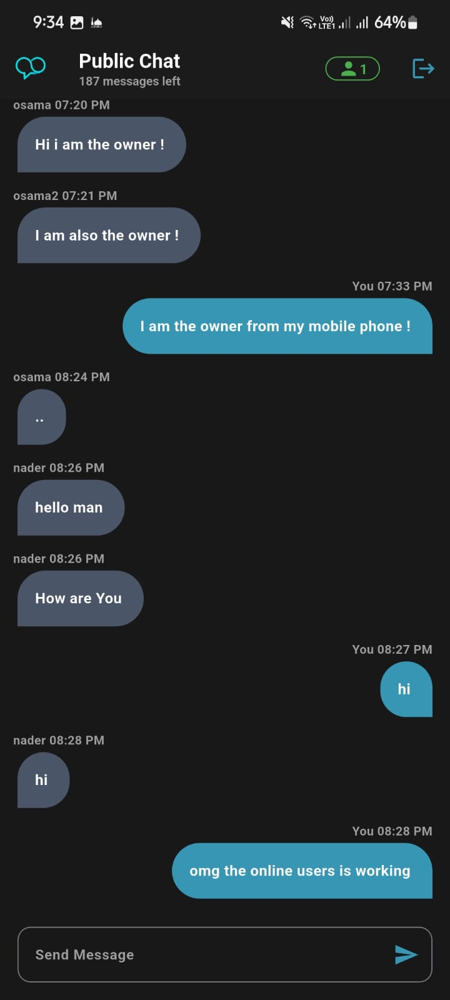

# LoopChat 💬

A real-time chat application built with **Flutter** and **Firebase**.  
This project was developed as part of my learning journey to strengthen my skills in authentication, real-time updates, and cloud integrations.  

[]([your_apk_link_here](https://drive.google.com/file/d/1dNxoPeqXg5hqiSSIiqJeUxEYFBqU2Aeb/view?usp=drive_link))
[](https://flutter.dev)  
[](https://dart.dev)  

---

## Features ✨
- **Authentication**:  
  - Register, Login, and Forget Password flows.  
  - Firebase Authentication for secure user accounts.  

- **Real-Time Chat**:  
  - Public chat room with instant messaging.  
  - Custom chat bubbles and smooth scrolling to latest message.  

- **User Presence**:  
  - Online user counter powered by Firebase Realtime Database.  
  - Cloud Functions for accurate user status updates.  

- **Daily Message Limits**:  
  - Each user gets a daily quota.  
  - Automatically reset at midnight via Firebase Cloud Functions.  

- **Cloud-Powered Features**:  
  - Firestore for message storage.  
  - Firebase Storage for media support.  
  - Firebase App Check for added security.  

---

## Screenshots 📸  
| Onboarding | Login | Chat |  
|------------|-------|------|  
|  |  |  |  

---

## Installation ⚙️
1. **Clone the repository:**  
   ```bash
   git clone https://github.com/yourusername/LoopChat.git
   cd LoopChat
   ```
2. **Install dependencies:**
   ``` bash
   flutter pub get
   ```
3. **Configure Firebase:**
   - Add ```google-services.json``` to ```android/app/```.
   - Add ```GoogleService-Info.plist``` to ```ios/Runner/```.
   - Run ```flutterfire configure``` if you want to regenerate options.
4. **Run the app:**
   ``` bash
   flutter run
   ```

## Project Structure 📂
``` bash
lib/
├── constants.dart
├── firebase_options.dart
├── main.dart
├── helper/           # Reusable helpers (e.g., update_checker.dart, show_snack_bar.dart)
├── models/           # Data models (e.g., message.dart)
├── screens/          # Pages (login_page.dart, register_page.dart, chat_page.dart, etc.)
├── start/            # Startup & onboarding flow
├── widgets/          # Reusable widgets (chat_bubble.dart, customButton.dart, etc.)
functions/            # Firebase Cloud Functions
```
## Key Learnings 🧠
- Implemented a full authentication experience using Firebase Auth.
- Worked with real-time communication using Firestore & Realtime Database.
- Secured the app with App Check and server logic in Cloud Functions.
- Designed clean, reusable Flutter widgets for consistent UI.
- Learned how to enforce feature limits (daily message quota) using backend logic.

## Acknowledgements 🙏
[](https://flutter.dev/) ↗ for the framework <br>

[](https://firebase.google.com/) ↗ for backend services <br>

ChatGPT & Gemini for helping with new stuff 😂


